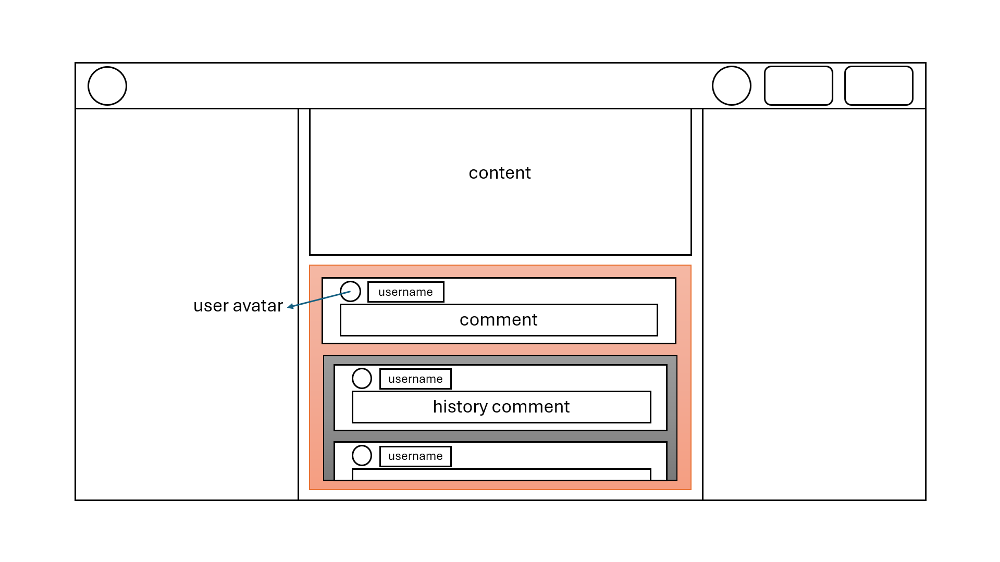
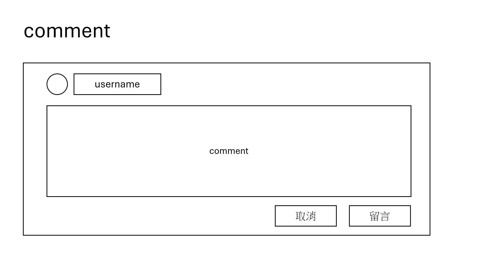
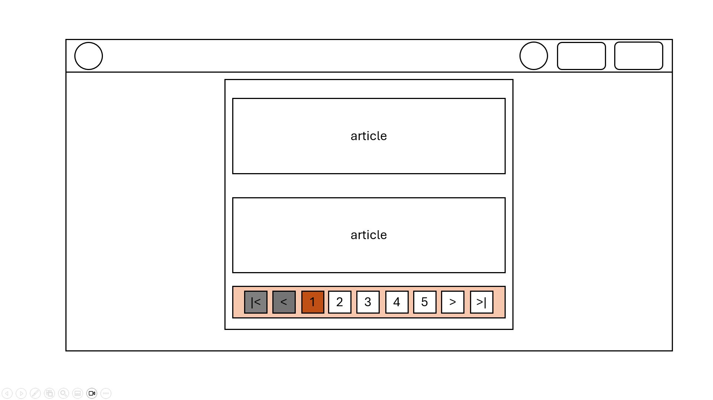
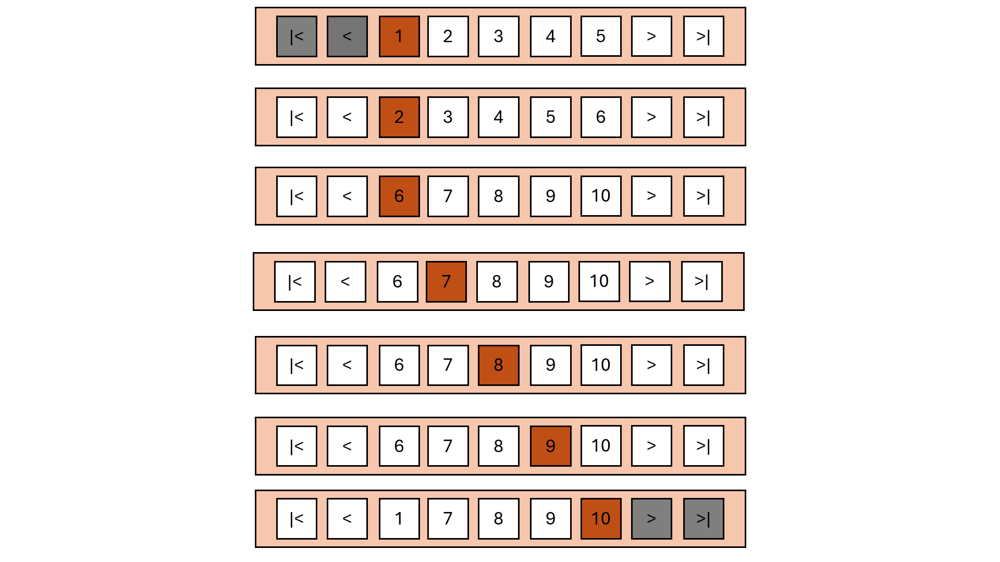

# Directories

```
.
├── home
|   ├── home.html
|   ├── home.css
|   └── home.js
├── ...(other pages)
|   ├── ....html
|   ├── ....css
|   └── ....js
└── public
    ├── css
    |    ├── fonts.css
    |    └── global.css
    ├── js
    |    ├── utils.js
    |    └── global.js
    ├── fonts
    |    ├── NotoSansTC-Regular.woff2
    |    ├── NotoSansTC-Bold.woff2
    |    └── ...(other fonts)
    └── images
        └── logo
            ├── logo.png
            └── logo.svg
```
### utils.js

`cookie, local storage ...`

### global.js

`BASE_URL, dark mode, sign in, sign up...`

### global.css

`header, main, footer, home button...`

### fonts.css

`woff2 format fonts...`

# Wireframe

## 1. Home Page


## 2. Article Preview


## 3. Article Content


## 4. Sign In Modal


## 5. Sign Up Modal


## 6. Comment Section



## 7. Comment



- 點擊comment(textarea)時, textarea會增加高度, 同時取消與留言按鈕會跑出來.
- 如textarea已被點擊過, 且comment為空, 被點任何其他地方, textarea會縮小, 按鈕也會隱藏
- 如textarea已被點擊過, 且comment不為空, 被點任何其他地方, textarea維持原狀
- 點擊取消按鈕, 清除textarea及縮小欄位

## 8. Paginator



## 8. Paginator Detail



- 以總頁數10為例
- 顯示頁數: 5
- 1~6頁時, 當下頁數在最左側
- 頁數7~10, 顯示頁數維持在6~10
- 頁數不足5時, 顯示全部頁數

# API

## Articles

### `全部文章`

**URL :** `BASE_URL/articles`

**Request :** `GET`

**Body :** `{ params: { search: keyword }`

**Response :**

```
[
  {
    id: XX,
    avatar: 'https://XXXXXX',
    username: 'XXXXXX',
    title: 'XXXXXX',
    category: ['XX', 'XX', 'XX'],
    picture: 'https://XXXXXX',
    content: 'XXXXXX'
  }
]
```

### `單篇文章`

**URL :** `BASE_URL/articles/articleId`

**Request :** `GET`

**Body :**

**Response :**

```
[
  {
    id: XX,
    avatar: 'https://XXXXXX',
    username: 'XXXXXX',
    title: 'XXXXXX',
    category: ['XX', 'XX', 'XX'],
    picture: 'https://XXXXXX',
    content: 'XXXXXX'
  }
]
```