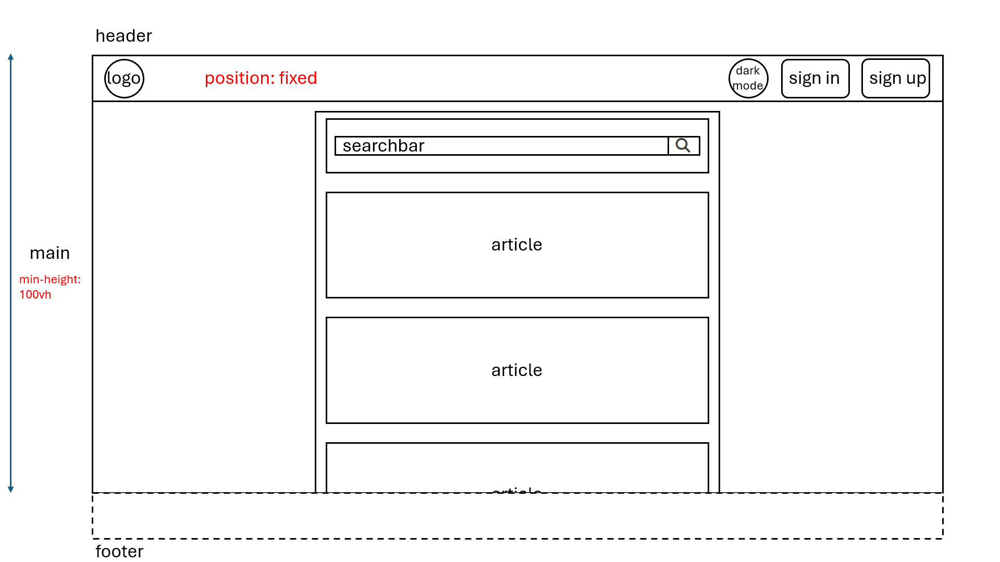
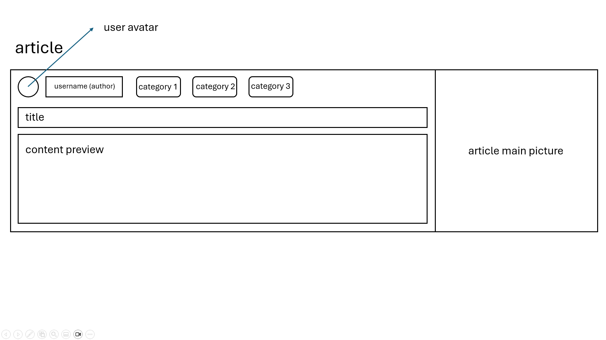
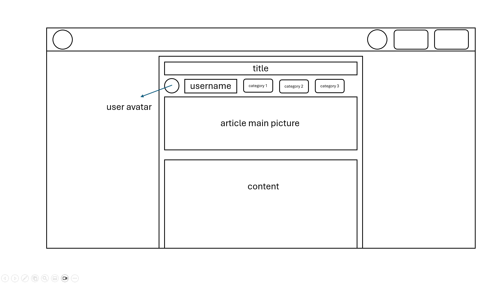
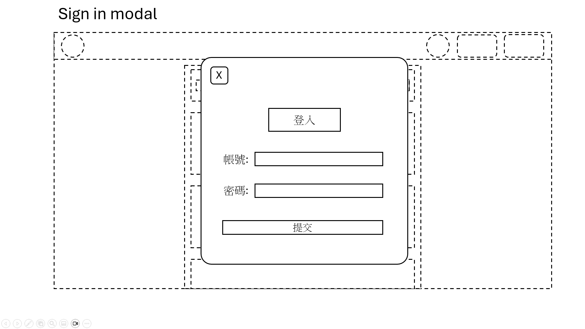
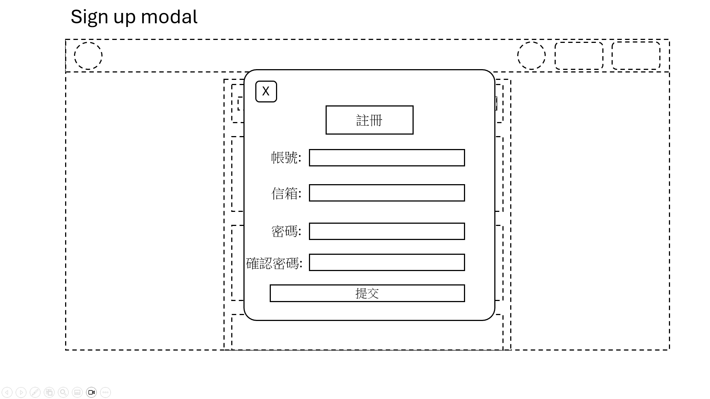

# Directories

```
.
├── home
|   ├── home.html
|   ├── home.css
|   └── home.js
├── ...(other pages)
|   ├── ....html
|   ├── ....css
|   └── ....js
└── public
    ├── css
    |    ├── fonts.css
    |    └── global.css
    ├── js
    |    ├── utils.js
    |    └── global.js
    ├── fonts
    |    ├── NotoSansTC-Regular.woff2
    |    ├── NotoSansTC-Bold.woff2
    |    └── ...(other fonts)
    └── images
        └── logo
            ├── logo.png
            └── logo.svg
```
### utils.js

`cookie, local storage ...`

### global.js

`BASE_URL, dark mode, sign in, sign up...`

### global.css

`header, main, footer, home button...`

### fonts.css

`woff2 format fonts...`

# Wireframe

## 1. Home Page



## 2. Article Preview



## 3. Article Content



## 4. Sign In Modal



## 5. Sign Up Modal



# API

## Articles

**URL :** `BASE_URL/articles`

**Request :** `GET`

**Body :**

**Response :**

```
[
  {
    id: XX,
    avatar: 'https://XXXXXX',
    username: 'XXXXXX',
    title: 'XXXXXX',
    category: ['XX', 'XX', 'XX'],
    picture: 'https://XXXXXX',
    content: 'XXXXXX'
  }
]
```